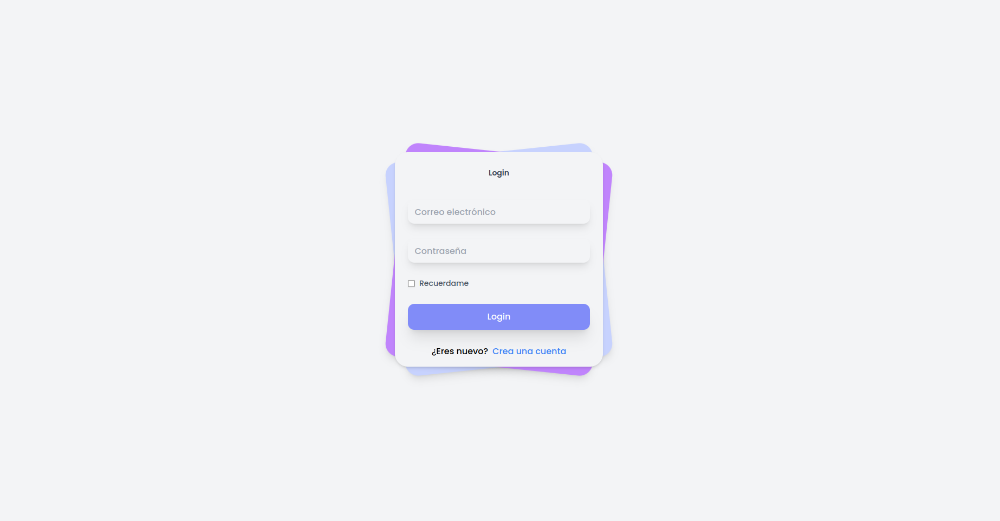
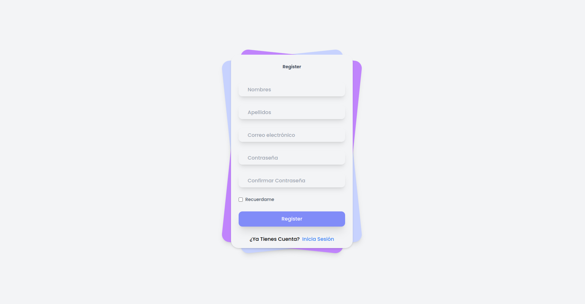
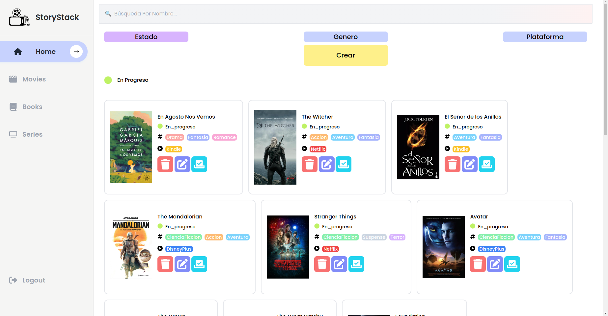
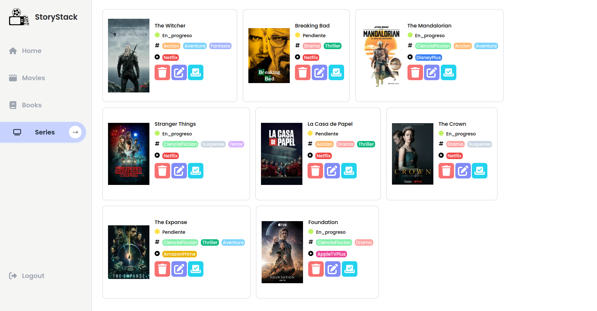

<div align="center">
  <a href="">
    
  </a>
<h1 text-align="center">StoryStack</h1>
</div>
  
## Tabla de Contenidos 🔗
1. [Información General](#información-general-)
2. [Tecnologías](#tecnologías-)
3. [Instalación](#instalación-)
4. [Screenshots](#screenshots-)
5. [Cómo Aportar](#como-aportar-)
6. [Autor](#autor-)

## Información General 📒
**StoryStack** es un proyecto de página web que permite llevar un registro de todas las series, películas y libros que ya hayas leído, que estás leyendo o que quieres leer en el futuro. Este proyecto se basa en la integración de JavaScript, HTML, y Tailwind CSS para ofrecer una experiencia de usuario amigable y eficiente en la organización y seguimiento de contenido multimedia.

## Tecnologías 🤖
Tecnologías usadas en este proyecto:
- JavaScript
- HTML
- Tailwind CSS

## Instalación 📦
```bash
git clone https://github.com/JuanJTorresB/Proyecto_JavaScript_TorresJuan.git
Abre el archivo index.html en tu navegador favorito.
Crear un Cuenta o Incia secion con estas credenciasles:
Gmail: bluey@gmail.com
Contraseña: Bingo
```

## Cómo Aportar 🛠
***
> Mejorar la funcionalidad de filtrado y búsqueda.

> Proponer nuevas ideas o funcionalidades Innovadoras

## Screenshots 📸
***





## Autor 🐦‍🔥
***
### Juan José Torres Becerra